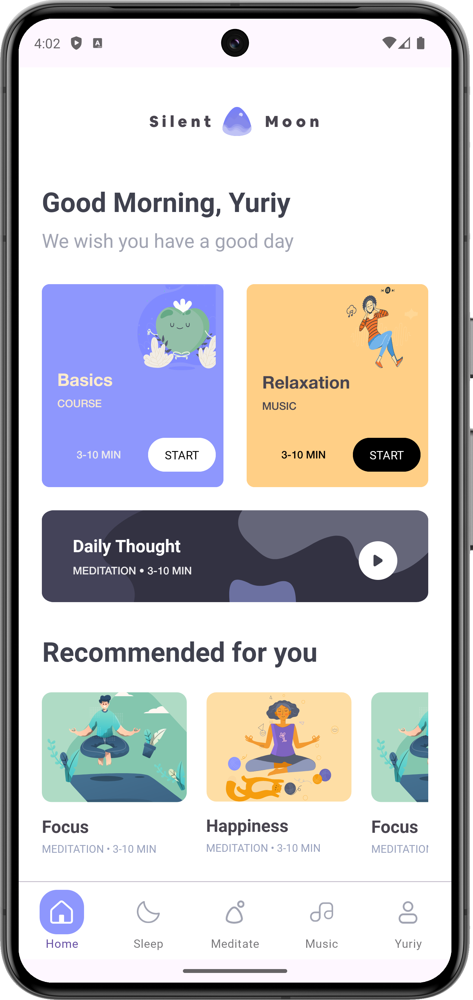

## A minimalistic app for meditation and quality sleep.

### Get ready to meditate in a quiet place

## 📚About

A project created as part of an in-depth course on mobile development, the main goal of which was to learn in-depth
about layout using View.

- <b>Single Activity</b>
- <b>Kotlin Coroutines</b>
- <b>Fragment manager</b>
- <b>Custom Fragment Factory</b>

## 📱Screenshot

<h3 > OnBoardingScreen | Registration Screen | Login Screen |  Welcome Sleep </h3>

    
     
     
     

<h3 >Home Section</h3>

    
     
     
     

<h3 >Sleep Section</h3>

     
     

  